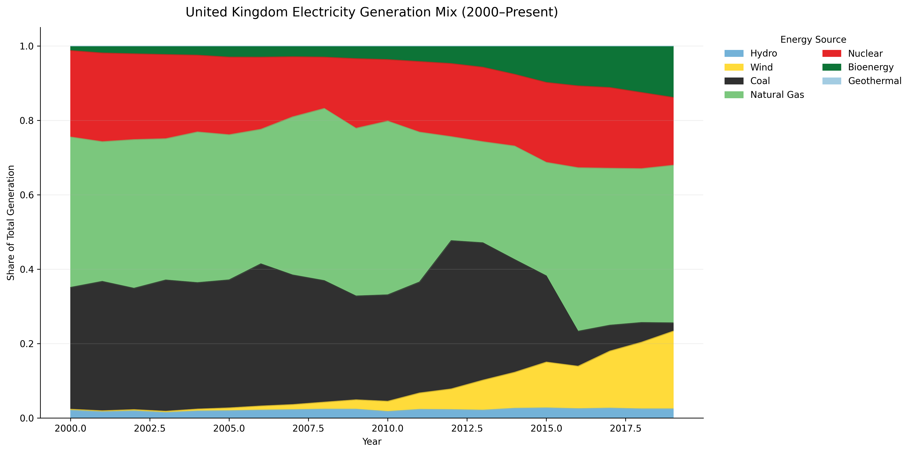
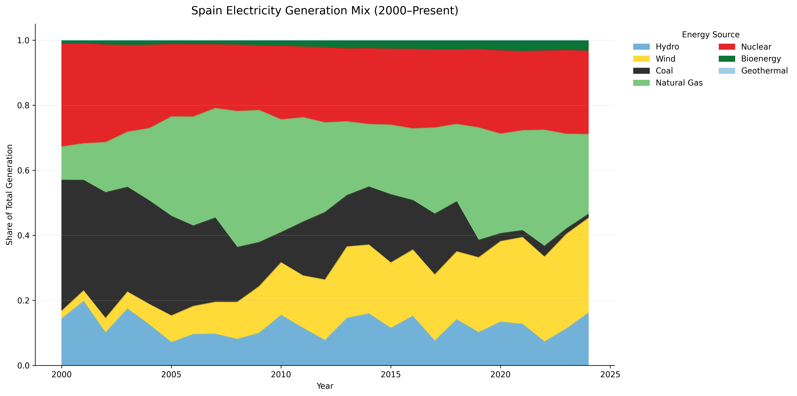
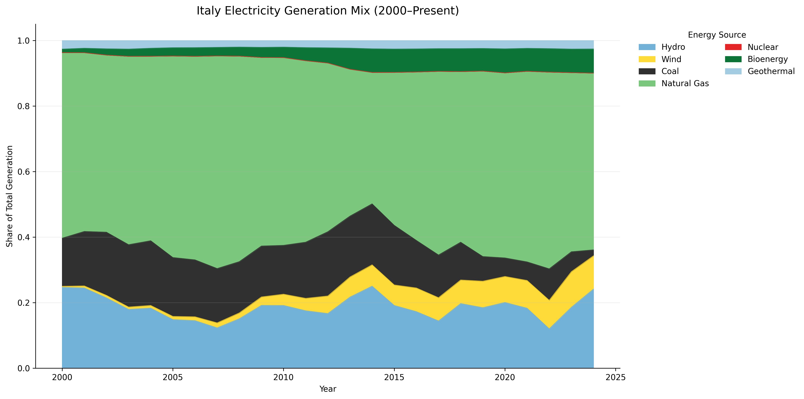
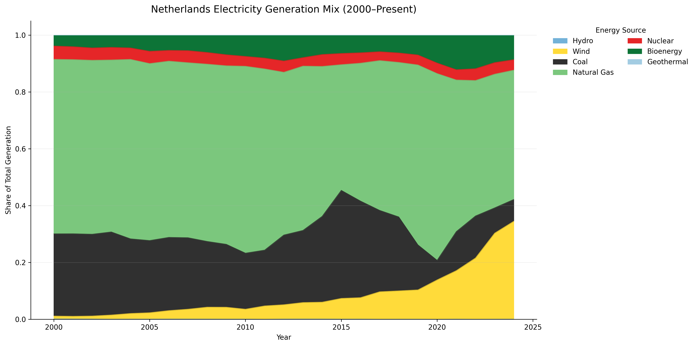
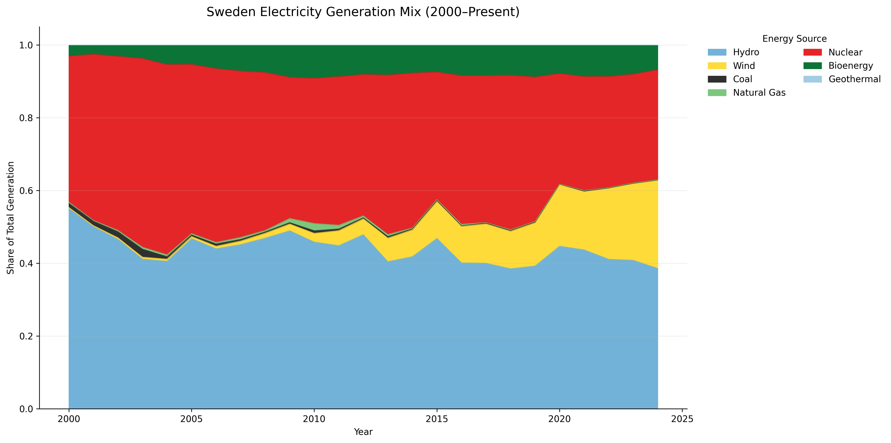
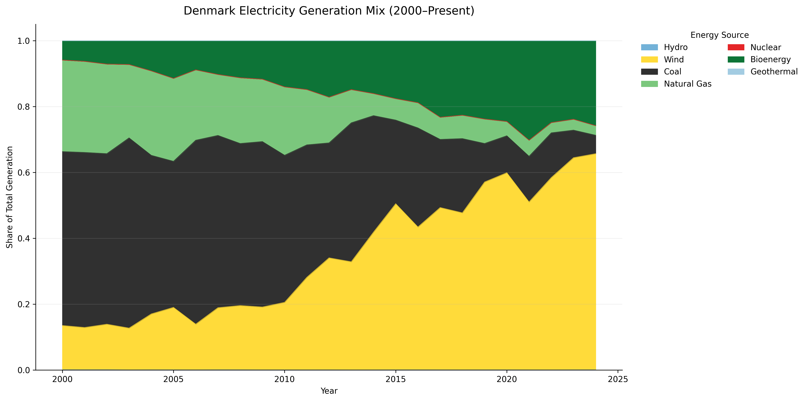

# Europe Energy Transition Tracker

An interactive data analytics project exploring how electricity generation sources have evolved across European countries from **2000–present** using Eurostat energy balance data.

This project transforms raw infrastructure datasets into a longitudinal analytical system that reveals how national power systems transition over time — identifying the dominant electricity source for each country and tracking structural change across Europe.

---

## Project Goal

Europe’s electricity system is undergoing one of the largest infrastructure transitions in modern history, shifting from fossil fuels toward renewable and low-carbon generation.

This project answers:

**Which energy source powered each country the most — and how has that changed over time?**

Beyond visualization, the goal is to build a reproducible analytics pipeline capable of:

- Detecting national energy transitions
- Comparing countries across time
- Measuring stability vs. volatility in energy systems
- Translating large public datasets into decision-ready insights

---

## Live Dashboard

Interactive Streamlit application:

https://energy-transition-tracker-gi-bi.streamlit.app/

Features include:

- Country energy mix explorer
- Europe-wide transition overview
- Country comparison analytics
- Transition stability analysis
- Downloadable datasets

---

## Data Source

**Eurostat Energy Balances**

Dataset:  
*Production of electricity and derived heat by fuel* (`nrg_bal_peh`)

- Unit: Gigawatt-hours (GWh)
- Geographic scope: European countries
- Temporal coverage: 2000–present

---

## Methodology

1. Cleaned and standardized Eurostat fuel categories
2. Aggregated fuels into analytical energy systems:
   - Hydro
   - Wind
   - Coal
   - Natural Gas
   - Nuclear
   - Bioenergy
   - Geothermal
3. Calculated total electricity generation per country-year
4. Computed generation share by source
5. Identified dominant electricity source annually
6. Built derived analytics:
   - Transition detection
   - Country comparison rankings
   - Transition stability (volatility) scoring

---

## Europe Energy Transition Timeline

Dominant electricity generation source for each European country over time.

---

## Country Energy Mix Explorer

Examples of country-level generation transitions:

### Germany

### France

### Norway

### Poland

### United Kingdom

### Spain

### Italy

### Netherlands

### Sweden

### Denmark

---

## Key Observations

- Hydropower remains structurally dominant in Nordic and Balkan regions.
- Nuclear provides long-term grid stability in France and parts of Central Europe.
- Coal dependence persists longer across Eastern Europe.
- Wind expansion accelerates sharply after ~2010 across Western Europe.
- Energy transitions occur unevenly — some countries shift rapidly while others remain stable for decades.

---

## Tech Stack

- Python
- Pandas
- NumPy
- Matplotlib
- Streamlit
- Google Colab
- Git & GitHub

---

## Repository Structure

energy-transition-tracker/
│
├── data_processed/   # Cleaned analytical datasets
├── notebooks/        # Exploration & dataset construction
├── figures/          # Generated visualizations
├── dashboard/        # Streamlit application
└── README.md

---

## Why This Project Matters

Energy transition analysis requires combining data engineering, analytics, and storytelling.  
This project demonstrates how large public infrastructure datasets can be transformed into interactive analytical tools that support policy, research, and energy market understanding.

---

## Author

**Jessica Grubbs**  
