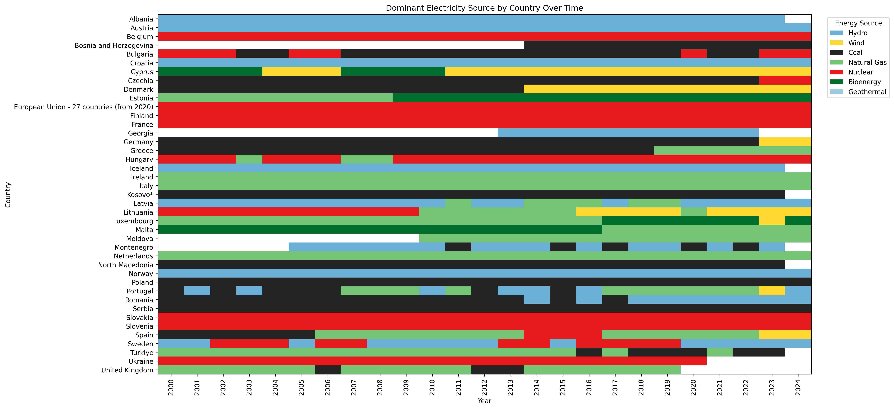
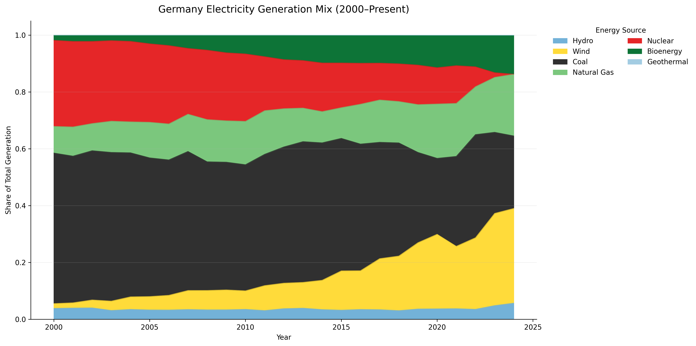
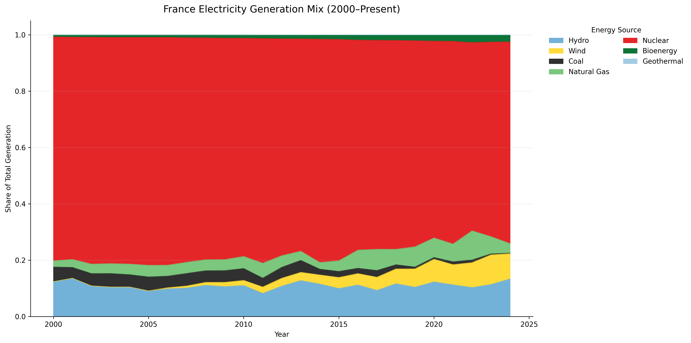
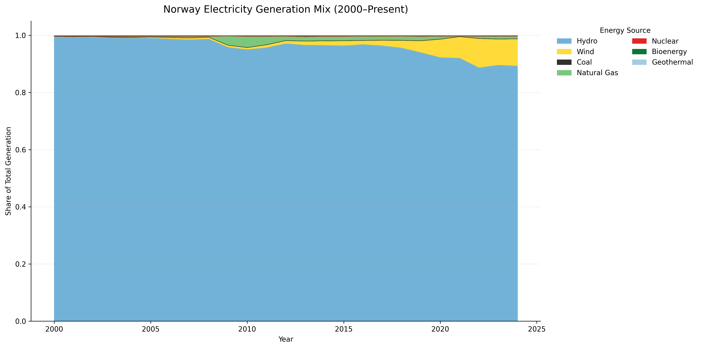
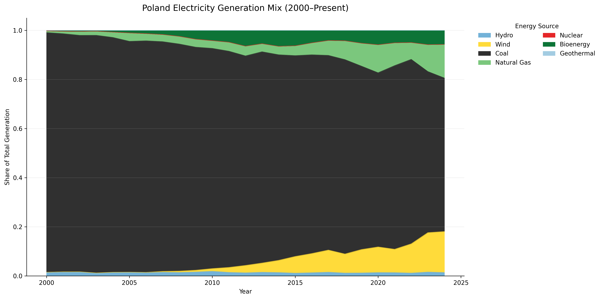

# Europe Energy Transition Tracker

An interactive analytics project examining how electricity generation has evolved across European countries from 2000 to the present using Eurostat energy balance data.

The project identifies which energy source dominated each country’s electricity production over time and highlights how national power systems transition between fossil fuels, nuclear energy, and renewables.

---

## Project Overview

Europe’s electricity infrastructure is undergoing a long-term structural shift. Instead of focusing on single-year statistics or headlines, this project analyzes energy systems longitudinally to answer a practical question:

**Which energy source actually powered each country the most, and how has that changed over time?**

To answer this, I built a reproducible analytics pipeline that:

- Detects national energy transitions  
- Compares countries across time  
- Measures stability versus volatility in generation systems  
- Converts large public datasets into clear, interpretable outputs  

---

## What This Project Produces

- A country-year dataset of electricity generation by source (GWh and share)  
- Annual dominant energy source classification  
- Europe-wide transition timeline visualization  
- Country energy mix analysis  
- An interactive Streamlit dashboard for exploration and comparison  

---

## Data Notes

Eurostat fuel categories do not map directly to simple energy labels, so fuels were grouped into analytical systems:

Hydro, Wind, Coal, Natural Gas, Nuclear, Bioenergy, and Geothermal.

Some countries contain missing fuel values in certain years. For share calculations, missing generation values are treated as zero.

---

## How to Run Locally

```bash
python3 -m venv .venv
source .venv/bin/activate
pip install -r dashboard/requirements.txt
streamlit run dashboard/app.py
```

---

## Live Dashboard

Interactive Streamlit application:

https://energy-transition-tracker-gi-bi.streamlit.app/

Features include:

- Country energy mix explorer
- Europe-wide transition overview
- Country comparison analytics
- Transition stability analysis
- Downloadable datasets

---

## Data Source

**Eurostat Energy Balances**

Dataset:  
*Production of electricity and derived heat by fuel* (`nrg_bal_peh`)

- Unit: Gigawatt-hours (GWh)
- Geographic scope: European countries
- Temporal coverage: 2000–present

---

## Methodology

1. Cleaned and standardized Eurostat fuel categories
2. Aggregated fuels into analytical energy systems:
   - Hydro
   - Wind
   - Coal
   - Natural Gas
   - Nuclear
   - Bioenergy
   - Geothermal
3. Calculated total electricity generation per country-year
4. Computed generation share by source
5. Identified dominant electricity source annually
6. Built derived analytics:
   - Transition detection
   - Country comparison rankings
   - Transition stability (volatility) scoring

---

## Europe Energy Transition Timeline

Dominant electricity generation source for each European country over time.



---

## Country Energy Mix Explorer

Examples of country-level generation transitions:

### Germany


### France


### Norway


### Poland


---

## Key Observations

- Hydropower remains structurally dominant in Nordic and Balkan regions.
- Nuclear provides long-term grid stability in France and parts of Central Europe.
- Coal dependence persists longer across Eastern Europe.
- Wind expansion accelerates sharply after ~2010 across Western Europe.
- Energy transitions occur unevenly — some countries shift rapidly while others remain stable for decades.

---

## Tech Stack

- Python
- Pandas
- NumPy
- Matplotlib
- Streamlit
- Google Colab
- Git & GitHub

---

## Repository Structure

```
energy-transition-tracker/
├── data_processed/    # Cleaned analytical datasets
├── notebooks/         # Exploration & dataset construction
├── figures/           # Generated visualizations
├── dashboard/         # Streamlit application
└── README.md
```


---

## Why This Project Matters

Energy transition analysis requires combining data engineering, analytics, and storytelling.  
This project demonstrates how large public infrastructure datasets can be transformed into interactive analytical tools that support policy, research, and energy market understanding.

---

## Author

**Jessica Grubbs**  
Data Analyst | Data Engineering & Energy Systems Analytics  

Built using Python, Eurostat open data, and Streamlit to explore long-term electricity transition patterns across Europe.

GitHub: https://github.com/Gi-bi

